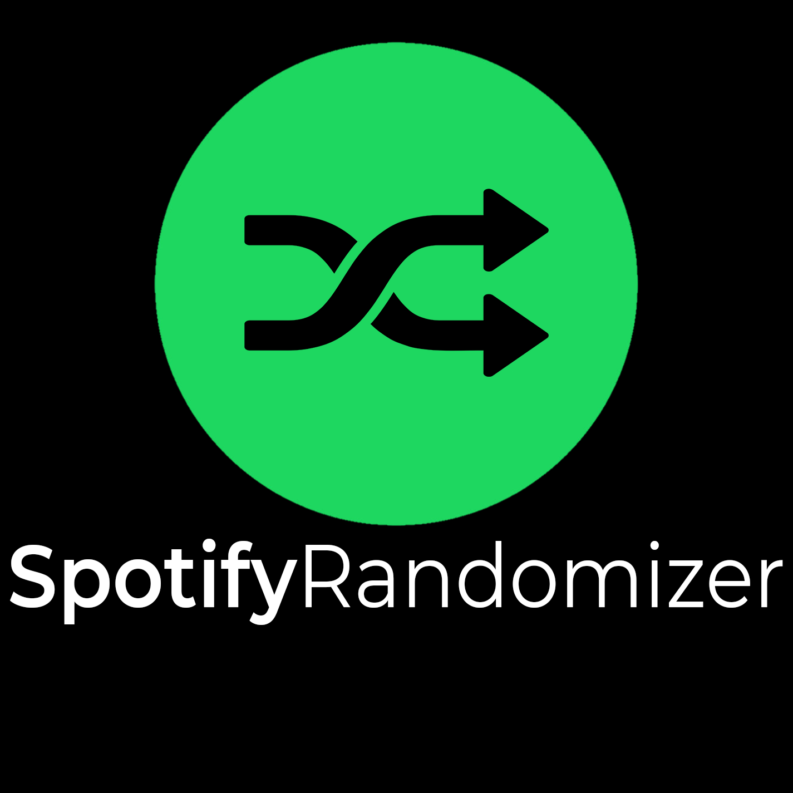

<p align="center"></p> <!-- Gross HTML because of GitHub's markdown -->
Truly randomize your Spotify playlists. This program creates a Spotify playlist from an existing one, with it's tracks placed in a random order, saved under a new name.


<sup>*\* An example of running the program.*</sup>


<sup>*\* The web server after authenticating. This only needs to be done once (per user).*</sup>

## Required packages

To use SpotifyRandomizer, you need [spotipy](https://github.com/plamere/spotipy).
You can install it using `pip`: `pip3 install spotipy`

## Setup

1. Create a spotify application so you can use `spotipy`. You can do this at the [Spotify developer website](https://developer.spotify.com/my-applications/).
2. Now you need to give the program your client ID & client secret. You can do this in 2 ways:
    1. Uncomment the lines in `randomizer.py` _(by removing the # in the beginning of the line)_ that set these variables and inputting yours.
       ```python
       os.environ["SPOTIPY_CLIENT_ID"] = "myclientid"
       os.environ["SPOTIPY_CLIENT_SECRET"] = "myclientsecret"
       ```
    2. Export those variables using your terminal. On windows:
    
       ```cmd
       SET SPOTIPY_CLIENT_ID=myclientid
       SET SPOTIPY_CLIENT_SECRET=myclientsecret
       ```
    
        On linux:
        ```bash
        export SPOTIPY_CLIENT_ID=myclientid
        export SPOTIPY_CLIENT_SECRET=myclientsecret
        ```
        
        You only need to do this once.
    
    The default redirect URL is `http://localhost:14523` for the local webserver.
3. You're done - you can basically change anything else you'd like.

## Run

The script can be ran by doing `python3 main.py`.
In this case the program will ask you for your username and playlist(s) while running.
You can also give that information as an argument, like this `python3 main.py 1234567890 Playlist1 Playlist2 Playlist3`

The playlists can be the name of the playlist or the ID of the playlist (found in the URL). These playlists have to be owned by you.

When you run the program for the first time, it will open the spotify website for authorization. Then you need to copy the redirected URL into the commandline. After this, the program should work.

### Other

Also check out [the repo SpotifyNoDupes](https://github.com/stavlocker/spotifynodupes) if you want to get rid of your duplicate songs in playlists.
